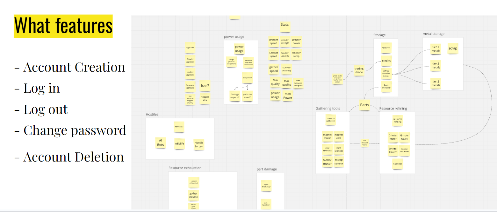
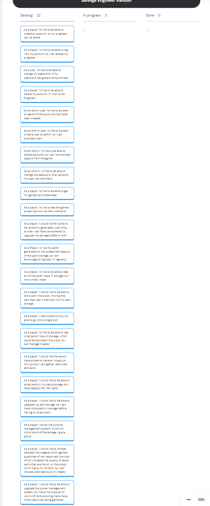

# Challenge 6 - Full-Stack Capstone Project - Salvage Engineer

```ascii
  ..,.oooE777999V(;
                                  ...oooP779090(;''       ''''  I
                    ...ooB777979V;;''       .....=v}}=}=}=}}v==  5
               97?(;''     .........< .    . .:.:.:.:.`:;``;;;;;;;;<;;;<;<<<<<<<<<<
                 b ;           . : .:.:.:.`;;;;;;;;;;;<;;<;<<<<<<<<, I
                 `,`               . : :.:.:.:.`.`;;;;;;;;;;;;<;<;<<. 5
                  b ;                    . : .:.:.:.`;;;;;;;;;;;<;<;<: E
                  `,<                         . . .:.:.:.``;;;;;;;;;;. I
                   b :                             . . :.:.:.:.:.:.;;;. 5
                   `>;                                  . .:..:.:.:.`.:  |
                    b :                                      . . :.:.:.x T
                    `,;                                          . . .::  E
                     b :                                               _  !4
                     `r :                                   __.__,--,;'))))).
                      b :                         ___...--'; `))))))))' '' `>!9eOc
                      `r :              __,--:-;;;)))))))))))'' '' ' ' _. -'-'.`!9Eg.
                       L : . __.--_--:,)))))))))))'' ' '  _. ._.-'-'-'-'\-'\---\/\ ``Qu.
                       `,: !x;:)))))))) ')'' ' _ _._-.'\'\_\_-'\''-\'_'\-'\'\ -_\'-\-. 95n.
                        D` ))))'''  _ .___.-_:/-/\/-_\ /-_, /-,\ \-/_\/\,-\_/-\/-/--' ..v<]9o.
                      __b :<> -_\._/\,- ,_ -\ _/\-\ _-\ -_/-\,\/,-/\_/-_\'\--' .vvvvvvv}v}}x}]NEo.
                .ooPO%LOCu  `< `/\_ -:\/_/-/,\/,/-,/_,-/\ :_\:_-:__-'' ...vvvvvvvvvvvvxx}vx}}}}==No
              .oPO'       `y. `< ~-\ _\/\_,- \ , - ,___..--' .......>>vvvvvvvvx>vvvvvvvvvv)v~~~`         iuuuaE'
  .@tTL'                        `y,  `< .-vvv<<<<<<<<vvvvv=>~~~~`         _uuua'''
.&P'                              `L,  `>>><<<<><>v~>^` `        _uuug'
                                      `L,  ~~`          _uuua''
                                        `L,:    _uuua''
                                          `LaE''
```

## Introduction

In this repo you will find the code developed for the final challenge on the Digital Futures Software Engineering program. In this readme file you will find the requirements set for the project, an overview of the project I designed and built to meet those requirements, an overview of the technology I used, and a breakdown of where I intend to take this project post academy.

The Full-Stack Capstone Project was in 2 parts.  First I needed to submit a proposal for my project idea.  Once this proposal was approved, I built the project and submitted the code to a hand in before presenting the project to an audience on the final day of the Academy.  The context of the project was for me to decide and the ultimate scope of it was also up to me.  However, there were some requirements that my proposal and project had to meet to be approved and to allow me to pass this final assessment.

### Non-negotiable Requirements

The following requirements had to be met by my full-stack application and my proposal should clearly demonstrate how the project will meet them:

1) **N-Tier Architecture:** Your application must have a clear separation of concerns between the client, server and database.  This means that you should have a client-side application that communicates with a server-side application that communicates with a database.  You may choose to implement a Microservice Architecture if your application requires more that one server-side application.
2) **RESTful API:** Your server-side application must expose a *RESTful API* that the client-side application can consume.  This should be made in the *Model-Controller-Service* pattern.  This should be a ***Node.js/Express*** application.  You may also use your services to proxy other third-party APIs if you wish.
3) **Database:** Your server-side application must have a database that it communicates with.  You may choose to use a SQL or NoSQL database and appropriate packages that allow you to interact with the database.  ***MongoDB*** is the recommended database for this project but using an ***SQL*** database is also acceptable.
4) **CRUD Operations:** Your server-side application must implement CRUD operations.  This means that you must be able to Create, Read, Update and Delete data from the database.
5) **Client-Side Application:** Your client-side application must be a *Single Page Application* (SPA) that consumes the *RESTful API* exposed by the server-side application.  You must use ***React*** and build your own components, however, the use of *third-party libraries* IS allowed.  You can make third-party API calls from your client-side application if you wish but you must meet the CRUD requirements of the RESTful API.
6) **User Interface:** Your client-side application must have a user interface that is easy to use and navigate.  You can use a CSS framework to style your application and make it responsive, *Bootstrap* or *Tailwind* are the recommended libraries for this.
7) **Authentication:** Your application must have a way for users to sign up, log in and log out.  You must also have a way to verify that a user is logged in and only allow them to access certain parts of your application if they are logged in.
8) **Authorization:** Your application must have a way to restrict access to certain parts of your application to only certain users.  This means that you must have at least 2 roles in your application and restrict access to certain parts of your application based on the role of the user.
9) **Testing:** Your application must have tests for the server-side and client-side applications.  You must have at least **80% test coverage** for both the server-side and client-side applications through unit and integration tests, done where possible using TDD.  Coverage reports should be obtainable through a command in your `package.json` file.
10) **Deployment:** Your application must be deployed to a cloud service.  You may choose to deploy your client-side and server-side applications to the same cloud service or to different cloud services.  You must provide a link to your deployed application in your proposal.
11) **Documentation:** You should produce documentation for your project that covers the design of the application, how to set up the application, how to run the tests and how to deploy the application.  This should include a link to some form of Kanban/Scrum-type board that shows the progress of your project, a review/retro of the project and future development plans.

---

## Project Overview

One of the instructions was to pick something we could be passionate about, and one of my hobbies is gaming. Mobile gaming has created a few new genres, and one of which is the Idle Game, something I thought would fit quite well with a RESTful API. I've played a few fantasy ones with friends and thought a scifi based one would make for an interesting project.

### The initial approach

From the requirements, I knew the application needed to have a database, needed to have a single page application, and use a RESTful API in it's design. With clear separation between these three things. This meant that while I had considered creating the front end as an APP in android studio, that it would have to be a React website. I also considered using C# to develop the backend server, but lack of experience in using the language as a server would impact what I would be able to create in the window before it needed to be submitted. This led me to decide that the tech stack I would use for this project would be:

- Front End: React website, hosted on Netlify
- Back End: NodeJS Express server, hosted on Render
- Database: MongoDB, hosted on Mongo's Atlas Service

Once this was decided, I started off thinking about what features I wanted the application to have. I knew I would need account creation, log in, log out, change password, and account deletion. I used Miro to start breaking down what the game would have in it.

eventually those ideas would look like this:



which formed the basis for this list:
- users to be able to move equipment from storage to a Slot
- users able to move equipment from a slot to storage
- equipment will have a type that will only fit in one slot
- equipment will generated randomly, with the quality determined by the equipment, upgrades and player position
- Players will be able to break down equipment for the raw resources
- Players will be able to assign themselves to a role to upgrade the effectiveness of that location
- Players will be able to Craft upgrades which give improvements to aspects, upgrading the claw for example will allow more resources to fit into the hopper. upgrading the scanner will mean salvageable parts would get picked up earlier, so they are less damaged and therefore better quality. etc. upgrade the storage area to store more components

from these I was able to create the wireframes and initial routes which fed into the proposal.

---

### Part 1: Proposal

you can find a copy of the proposal [here](/docs/proposal/proposal.md)

---

### Part 2: Developing the Application

Once my proposal had been accepted, my next step was to break down the problem into the user stories I would need.



which then fed into creating the routing diagrams for the routes I knew I would need.


routing diagrams can be found in [here](/docs/planning/routingdiagrams.md)

Next I applied thinking in react to break down my wireframe diagrams into component hierarchies, though in hindsight these only really scratched the surface of what i would need.


[Wireframes](/docs/planning/wireframes.md) and [Component Hierarchies](/docs/planning/component%20diagrams.md)

#### Accounts Routes

Once I had these down, I next turned to prioritising the order of development.  I decided to create my application in slices, starting with the front end components and front end service and then the back end Route and service. To meet the requirements of authentication and authorisation, as well as saving the users data, I first started with the Accounts routes. Account creation initially, and then logging in. In research for a previous challenge, I had learnt how to use HTTP only cookies as a securer way to handle authentication tokens than to write the code to store them in local storage and transmit them. As this seemed like a pretty strong and reliable method to use, I chose to reuse this system. When the user logs in, a JsonWebToken is created and stored in a http only cookie and sent to the user. Both cookie and Token have a life of only 24 hours. There are a few ways which could strengthen this, such as recording the origin of the user in the cookie, but I felt were unnecessary given the nature of the application.

For security purposes, I also, from the get go, used Bcrypt to hash the passwords, so nothing was being stored in a plain text format on the database.

Once users had the ability to create an account and Log into it, the next step was to create the account management page. Giving users the chance to change their password, or if they so desire, delete their accounts.

#### Admin Routes

After creating the basic account routes, I moved onto the admin routes. Creating the page and then the routes themselves to allow an admin user to delete accounts, change passwords, and promote them to admin.

#### Game Routes

Once the account and admin routes were complete, I then started to work on the actual game itself. The first part of this was the creation of the get game data route. This route doesn't just get the players data from the database, it also checks how much time it has been since the last time parts and resources have been generated, and generates them based on that time frame. It then updates the database and send the data to the player, which could then be displayed on the front end.  In my original idea for the game, there was going to be a database of parts which could be drawn from, when I started thinking about how to actually implement this, I thought it would be more interesting if these parts could be randomly generated, with the same part potentially being better or worse to simulate what finding these parts on a scrap planet might resemble. In hindsight, this was a mistake. The code for this generation takes up around a 1/4 of the server code, and resulted in several issues.

- The first generation of the code resulted in exponential growth in the components to the point the numbers were the hundreds of thousands within a relatively small time period.
- I also made the mistake of not considering that an object passed in from the user couldn't be directly compared to an object sent by the database. This resulted in me having to write a custom linear search which also compared the property fields to make sure what the user had sent matched what the database said they had.
- There was no easy way to differentiate between the different categories of part.
- This method of generation won't be as easily scaled. Short of making the potential numbers bigger, moving into different zones doesn't offer an easy way to change the nature of the parts being generated...at least not without a large overhaul of the generation code.
  
The routes for swapping parts and setting power settings followed relatively quickly after the get data one, I made the decision to not trust the data from the user, in part swapping and destruction, it is used only to locate the part in the players part storage, if a matching part is not located then it can't be swapped into the slot. This should stop players from sending fake parts. The power management route also confirms the players power selection choice are valid before applying it to the game data and allowing it's values to impact on resource generation.  

### Testing

I tried to apply a test driven approach to my development. I did find it a lot easier to do this with the back end than the front. Front end testing is an area I need to work on before it comes naturally to my way of thinking. It took me some time before I was able to get my head around some of the concepts behind testing interfaces, but by the end of the project I believe I was starting to get the hang of it.

On the back end, I used a combination of Chai, Sinon and Supertest to test and mock aspects of my program. My biggest challenge came from trying to successfully mock the random number generator to ensure the part generation algorithm worked as intended. my testing coverage indicates a 98.49% coverage.

On the front end, Vitest was combined with Jest and Testing library to mock user inputs and axios responses, resulting in a 94.41% coverage. While I am becoming more familiar with testing front ends, I found having a development version running on my second screen more beneficial for testing that components are in the right places, it did allow me to ensure changes to data were being handled as I intended them to be.

## Reflection

In truth, I was somewhat naiv in how much I would be able to achieve in the time period we had set for this project. My initial 22 stories needed to be expanded to 26 to cover some of the things I had missed in my initial deliberations but needed to be included to meet my intended minimum viable product. Of these I was able to complete 24 of them, but required a lot more time than I had originally envisioned it taking. I am glad though I took the approach to slice my project up and work on the front end to back end and make sure each part was working before moving onto the next one.

### Deployment

In my proposal I had chosen to stick with the suggested deployment methods of Netlify for the front end and render for the back end. Largely because these offer a free service that seems to be quite stable. One of my largest problems would arise from this decision as it would make my authentication system not work. When I was running it locally the host and the client were both running on the same host. It didn't occur to me that I wouldn't just be able to just indicate who the front end and back end were located and it would be happy with that. The cookies I was using for authentication weren't being included, and so while a user could log in, none of the features behind the login were working correctly. The solution for this ended up with loosening the cookies same site restriction down from strict. A problem which should be fixed by ensuring the site and the back end are on the same domain.

### Where to next?

My original plan had some upgrade systems still outstanding and the routes to support them. The next stage after that was to start looking into having different zones for the player to travel to, with their own parts. I would also like to start adding more the game mechanics to it. Right now there is no challenges or risks for the player to overcome. A lot of this genre of game typically have some kind of enemy to fight. So it would be nice to look into some kind of weapon system which would give the player somewhere else to apply power as they level up. This would give them the challenge of judging how they wish to apply their power to maximise their progress. Failure might have them reverting to a different zone...maybe they need to overcome a boss to unlock a new place to scavenge from with different resources only available in certain places.

An area I most need to improve upon in the existing code is a result of my largest mistake, the development of the part generation algorithm. At the moment, they system generates completely random parts based on the player's stats. I intend to change this to each zone having a list of parts which the stats will give varying access to. This was my original idea for the system, but i changed my mind when I started to think about how to implement it and thought the present system would give more variety and less predictability to the player. In hindsight though it will make scaling up the game and expanding the zones more complicated. It also would require a lot more code to give different zones their own parts lists.

At the moment the admin tools are a part of the normal webpage, whose access is controlled by a user state and as part of the authorisation token on the back end. I have plans to create a Windows Application using C# which uses a login and offers access to the admin controls as a standalone program. As part of this I intend to expand the admin controls to give admins more control over the player accounts and review player data.

Tutorials, there is no explanation or guide to assist a new user in their experience, and nothing which informs the player of the games narrative to explain why they do the thing they are doing. Introductory story and tracking if the player has completed it will need to be added to account log in. This could potentially be put on it's own page to allow players to re-experience any of the games narrative and review the tutorial if they come back to the game after an absence. 