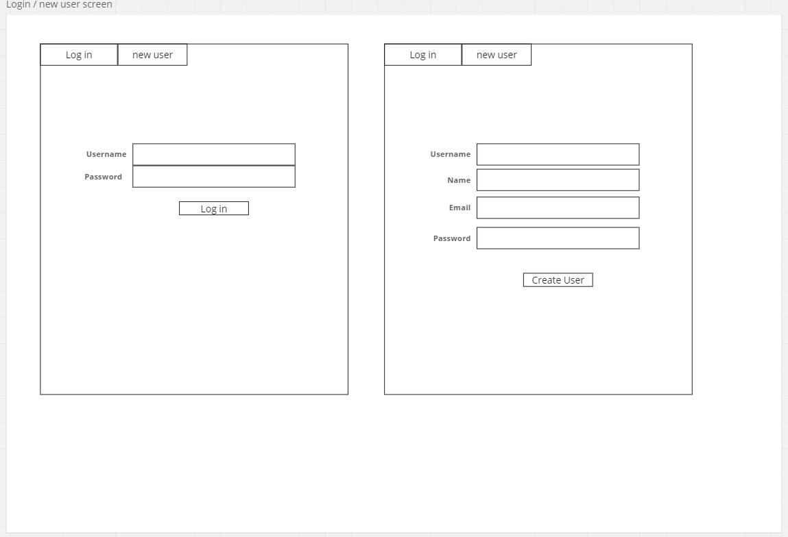
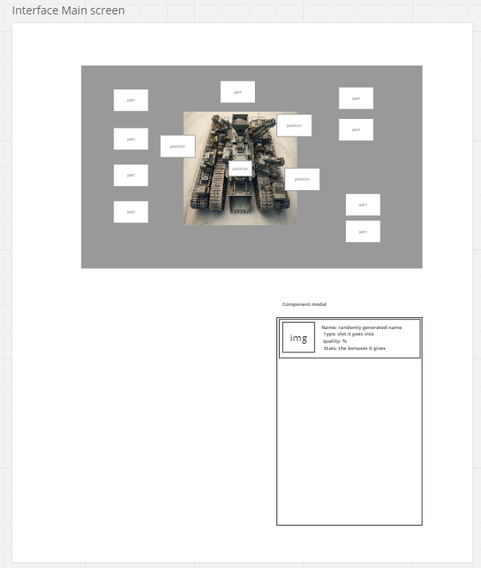
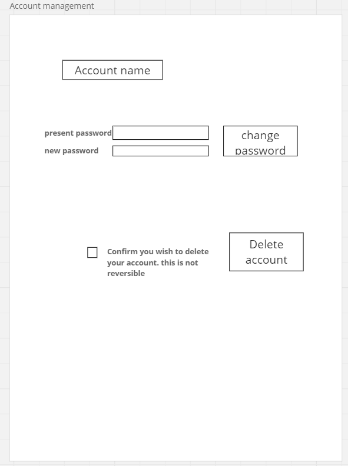
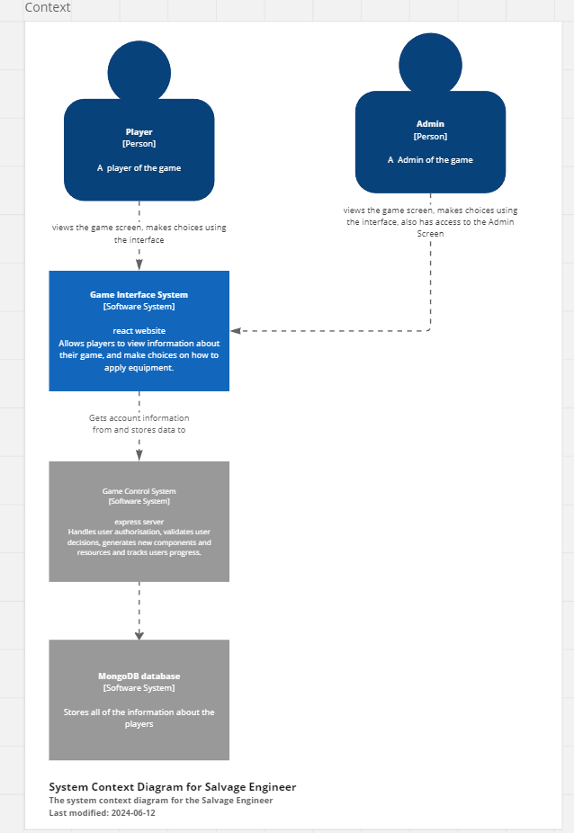

# Challenge 6 Proposal

miro board: https://miro.com/app/board/uXjVK8oDUFI=/?share_link_id=932710563692

## Title

Salvage Engineer

## Description

Inspired by the mobile games Ulala and Nobody's Adventure chop chop, Salvage Engineer has the user play the role of an Engineer who has crashed landed on a world which had been used as a dumping ground for rubbish from a space travelling civilisation. The player will manage the components of their salvage platform. They will need to search for upgrades and invest in components to enhance the effectiveness of their platform, while choosing settings to optimise for the region they are salvaging from. Some regions will be better for gathering raw resources, others for rare resources and others for components and upgrades. The user will also need to assign themselves to a particular role aboard the platform to give bonuses to that role while an upgradeable AI handles the other positions.

Progress is a real time mechanic and will require the player to return to the game various times throughout the day, usually referred to as an idle game.

There are plans to allow groups of players to work together to combine their skills, and for larger scale corporations though these will be outside of the spoke for this project.

## Context

The goal for this project is to create an entertaining idle game which would require the player to join the game multiple times throughout the day to make progress. From a monetisation point of view, adverts could be served to the user and the return visits would allow for multiple views a day. Users could be charged for an ad free experience or ways to make their characters more unique.

The intended users are gamers who enjoy idle games as a way to spend a few minutes every now and then during the day.

## Features

A list of features that my project will have

- Account Creation
- Account Deletion
- Log in
- Log out
- uses to be able to move equipment from storage to a Slot
- uses able to move equipment from a slot to storage
- equipment will have a type that will only fit in one slot
- equipment will generated randomly, with the quality determined by the equipment, upgrades and player position
- Players will be able to assign themselves to a role to upgrade the effectiveness of that location
- Players will be able to break down equipment for the raw resources
- Players will be able to Craft upgrades which give improvements to aspects, upgrading the claw for example will allow more resources to fit into the hopper. upgrading the scanner will mean salvageable parts would get picked up earlier, so they are less damaged and therefore better quality. etc. upgrade the storage area to store more components 
  
## User Interface

 A description of the user interface of my project.

### first screen

Log in/Account creation - tabs to switch between the two options

### main screen

primary game screen - component slots laid out over an image of the salvage platform, clicking on a component will open up a modal showing the available components for that slot. clicking on the storage location will open up the inventory of all components in storage. On the modals showing components user will be shown the components stats, and be given the option to equip it or break it down for resources.

### account management screen

users have the option to change their password or delete their accounts. both will require the user to enter their email address and password as confirmation they are the account user.

### Admin screen

only available to admin users

displays all user accounts, with the option to delete accounts.

## Architecture

Front end will be a react website, this will link to a express node JS server, which in turn communicates with a Mongodb service for storage

Initial plans are for Admin to access the admin tools through the same interface as a user.

Future plans could include a mobile app for players and a stand alone windows app created in a c# form application which should be able to connect to the same back end server.

## RESTful Routing

A list of the RESTful routes that my project will have

### newuser

- method: post
- payload: { username, password, email, name}
- response: 200 - new account created, 424 - failed to create, or 500 - server unavailable

### login

- method: post
- payload: { username, password}
- response: 201 - logged in and AWT token, 401 - incorrect username/password, 500 - server unavailable

### update

- method: get
- header: AWT token
- payload: n/a
- response: 200 - {user data object}, 401 - unauthorised, 500 - server unavailable

### changepart

- method: post
- header: AWT token
- payload: {slot, componentID}
- response: 200 - part changed, 400 - bad request, 401 - unauthorised, 500 - server unavailable

### changejob

- method: post
- header: AWT token
- payload: {job}
- response: 200 - job changed, 400 - bad request, 401 - unauthorised, 500 - server unavailable

### upgrade

- method: post
- header: AWT token
- payload: {job}
- response: 200 - job changed, 400 - bad request, 401 - unauthorised, 500 - server unavailable

## Technologies

A list of the technologies that you will be used in this project, including external dependencies and testing tools.

### Frontend

- React
- React-bootstrap
- React-dom
- React-router-dom
- formik, yup
- axios
- cookies
- json-server

### Backend

- NodeJS
- mongodb
- axios
- bcrypt
- mongoose
- jsonwebtoken
- express
- express-validator
- dotenv
- nodemon

### Testing

- Testing-library
- Supertest
- Vitest
- Mocha
- Jest
- Chai
- Sinon
  
## Deployment

Initial plans for deployment are to use Netlify to host the front end of the app, and Render for the NodeJs back end part. With the database being hosted on Mongo's Atlas service.

For environment variables, the front end will need to know where the back end is. The back end will need to store the database location and the key for accessing it. Since the free services I am intending to use will need to have my project stored in at least one public repo, any other passwords or authorisations may also be needed to be saved. 